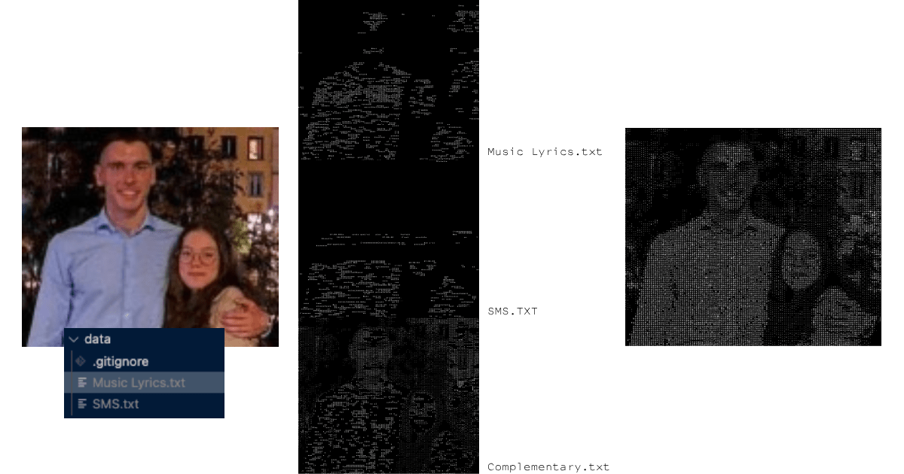

    

# VIMonths

This project aims to generate n layers from a set of text files, where their superposition forms a grayscale or colors image. 
The main idea is to determine the appropriate spacing between each word to create a harmonious overlap of the layers. By adjusting this spacing, we can generate creative and artistic textual images.

  

    

 
Low RES image generation using only <b>2 layers</b>.

  

    

The images are arranged from left to right, showing the Original Image, White Background, Black Background, and Black Background with an auto-generated 4-color palette.

Please note that any stripes you may observe are artifacts caused by the screen sampling and do not exist in the actual generated image.

 

## Installation

At the moment, pip install is not supported for this project. Instead, you can <u>download the repository</u> directly.
## Rapid Usage
To use the project, follow these steps:

&nbsp; 1. Locate the project repository folder.

&nbsp; 2. Drop an image in the `images` folder.

&nbsp; 3. Drop a font into the fonts folder. You can download a font from [this website](https://www.dafont.com/fr/).

&nbsp; 4. Go to the `scripts/main.py` file and update the variables :

 

    

 

&nbsp; 5. Install depedencies by running `pip install -r requirements.txt` in the terminal.

&nbsp; 6. Run the file `main.py` file.

&nbsp; 7. Check the results in the `results` and `grid` folders.

## Parameters and Detailed Explanations

- `black`: Expects a boolean value. Set it to `True` to generate the image on a black background, or `False` for a white background. 

    
&nbsp; &nbsp; &nbsp; &nbsp;&nbsp;&nbsp;&nbsp;&nbsp;&nbsp;&nbsp; Note that this parameter not only changes the color but also affects the intrinsic generation of the image. The arrangement of words will differ between layers depending on the background color.

- `to_print`: Expects a boolean value. Set it to `True` if you intend to generate a printable version of an image generated on a black background. 

&nbsp; &nbsp; &nbsp; &nbsp;&nbsp;&nbsp;&nbsp;&nbsp;&nbsp;&nbsp; For example, if you want to manually replicate the image on a dark surface using a white pen. Printing in black on white while keeping the layers identical will help conserve ink usage on your printer.

- `num_colors`: Expects an integer value. Set it to `0` if you want a black and white image. 

&nbsp; &nbsp; &nbsp; &nbsp;&nbsp;&nbsp;&nbsp;&nbsp;&nbsp;&nbsp; This parameter aims to generate a palette of "n" colors to preserve the original colors as closely as possible using a limited number of colors.  This allows for replication using a specific number of markers or pens. 
&nbsp; &nbsp; &nbsp; &nbsp;&nbsp;&nbsp;&nbsp;&nbsp;&nbsp;&nbsp; However, it's important to note that due to the algorithms used, the resulting colors can vary significantly with each generation. In some cases, it may be necessary to perform multiple generations on the same image to obtain an acceptable colorized version.

- `threshold`: Expects an integer value. It determines the maximum average brightness difference between the word and the underlying pixels. 

&nbsp; &nbsp; &nbsp; &nbsp;&nbsp;&nbsp;&nbsp;&nbsp;&nbsp;&nbsp; A lower threshold value will result in a more accurate image representation, but it may limit the number of words that can be placed on the different layers from each text file..

## Project Architecture

- The `data` directory: contains the text files used to generate the image layers.  
- The `fonts` directory: contains the font files used to generate the image layers.  
- The `grids` directory: dedicated to saving the text files containing the character and colors grids representing the generated image.  
- The `images` directory: dedicated to storing the images to be converted into grids.  
- The `scripts` directory: contains the Python script to generate the end image and its layers. 
    - `main.py`: script for converting an image into a character grid and saving it.  
- The `modules` directory: contains the project-specific Python modules.  
- `README.md`: file that contains project information and instructions.  
- `ROADMAP.md`: A project document that showcases the progression of the project at different stages of development.

## Thanks for reading!
 

    

